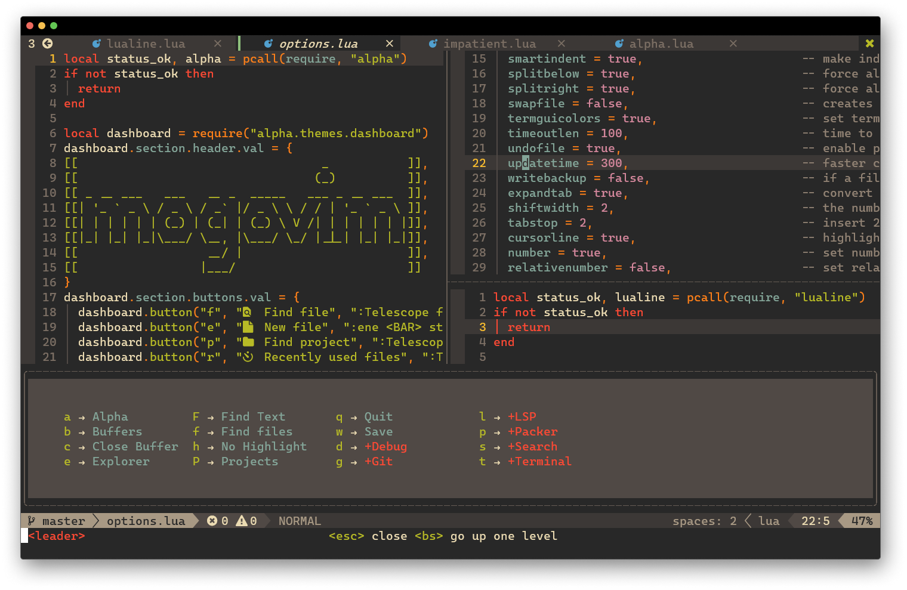
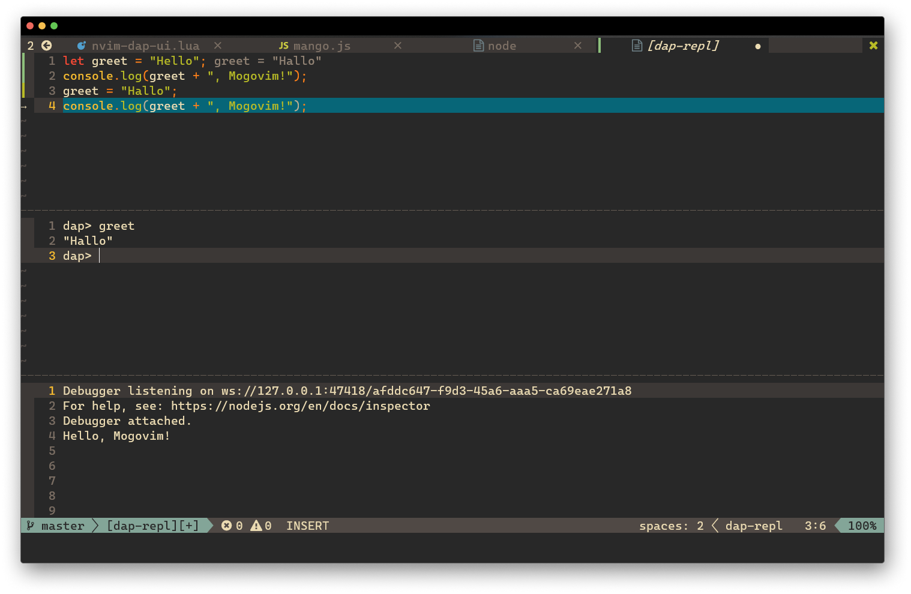
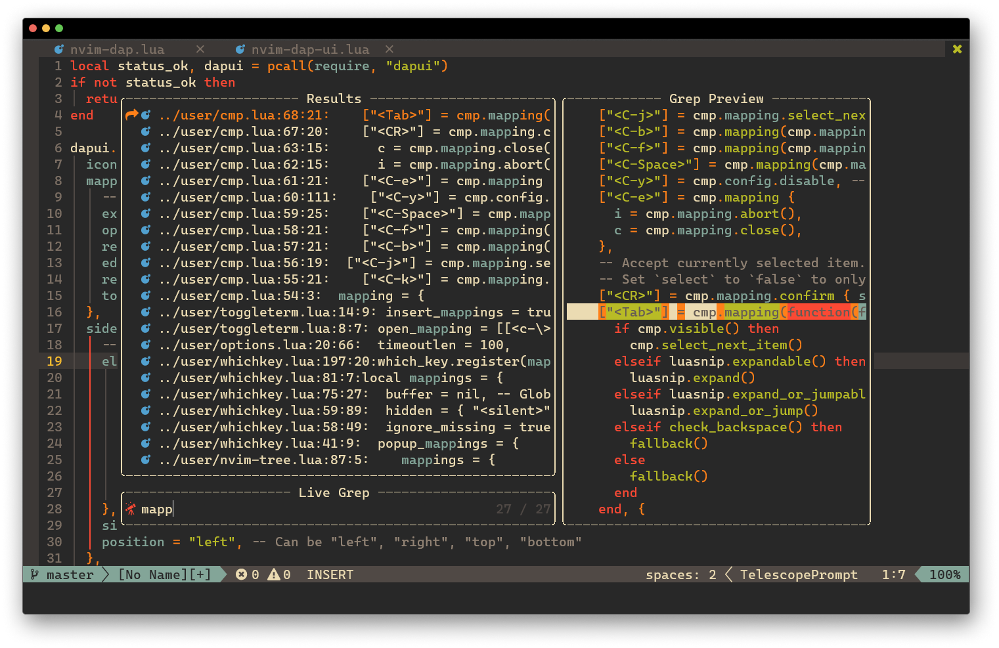

# 🥭 Mogovim

Ken's Neovim config.
chris@machine's Neovim-from-scratch template + some improvements

Make Neovim a good dog.

Featuring LSP, code debugging, global statusline, Telescope search, and bug fixes for chris@machine's config.
Blazing fast startup time, starts in ~ 0.01 to 0.04 seconds.





## 📦 Install

### Linux / Mac

```bash
git clone https://github.com/notken12/nvim.git ~/.config/nvim
```

### Windows

```powershell
git clone https://github.com/notken12/nvim.git $env:LOCALAPPDATA/nvim
```

## 📃 Requirements

Neovim nightly (development version): https://github.com/neovim/neovim/wiki/Installing-Neovim

### GCC

```bash
sudo apt update
sudo apt install gcc
```

### Node.js

```bash
sudo apt update
sudo apt install nodejs
npm i -g neovim
```

### Python

```bash
sudo apt-get update
sudo apt-get install python3.8
pip install pynvim
```

## 🪄 Use

Run

```bash
nvim
```

and let the plugins automatically install.

To add support for a language, run these nvim commands:

```
:TSInstall yourlanguagename
:LspInstall yourlanguagename
```

See https://github.com/mfussenegger/nvim-dap/wiki/Debug-Adapter-installation for how to add debug adapters for code debugging.

Installed color schemes are vscode, gruvbox, and some others.

## 💞 Contribution

If there's anything missing or something you don't like about this config, feel free to make one. Thank you!
